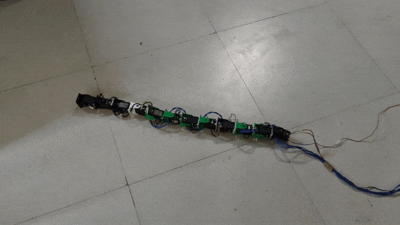
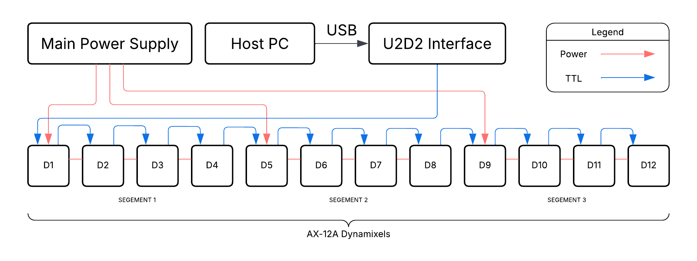
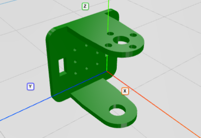

# Snake Bot

> A 12-DOF bio-inspired snake robot built with Dynamixel AX-12A servos capable of sidewinding locomotion.

---

## Overview

**Snake Bot** is a modular, biologically inspired snake robot built from 12 Dynamixel AX-12A servo motors. Inspired by the lateral undulation and sidewinding gait of real snakes, this robot uses sinusoidal position control across alternating horizontal and vertical motor axes to achieve smooth, coordinated locomotion.

The project was developed in progressive stages from dual-motor validation to full 12-motor sidewinding and runs entirely on a PC via the Dynamixel SDK within ROS.




## Objectives

- Replicate serpentine locomotion.
- Design a modular mechanical system with custom brackets for scalability
- Develop and validate motor control incrementally (2 → 4 → 12 motors)
- Achieve stable sidewinding gait using sinusoidal wave control
- Manage power and data distribution safely across 12 daisy-chained motors

---

## Hardware Design

### Motors
| Component | Specification |
|---|---|
| Servo Model | Dynamixel AX-12A |
| Count | 12 motors |
| Protocol | TTL (Half-Duplex UART) |
| Baud Rate | 1,000,000 bps |
| Position Range | 0 – 1023 (300° range) |
| IDs | 1 – 12 |

### Topology



### Power Architecture
- 12 motors are split into **3 groups of 4** for chained power sharing
- Each group shares power within its 4 motors to prevent overcurrent through connector wires
- **Data (TTL)** runs as a single continuous chain across all 12 motors
- This hybrid approach allows safe current distribution while maintaining a unified communication bus

### Wiring
- Motors are connected in a **daisy-chain** configuration using standard Dynamixel 3-pin JST connector cables
- Power lines split at group boundaries; signal line continues unbroken through all 12 motors

### Custom Brackets
Custom-designed motor brackets were fabricated to:
- Connect two motors continuously in series using **Dynamixel-compatible axial attachments**
- Allow **free rotation at the joint axis** between connected motors
- Provided room for **wire management channels** to route cables cleanly alongside the body
- Enable the alternating **X–Y–X axis** orientation pattern required for 3D locomotion



### Motor Axis Pattern
Motors alternate between horizontal (X) and vertical (Y) bending planes:

```
Motor:   1    2    3    4    5    6    7    8    9   10   11   12
Axis:    H    V    H    V    H    V    H    V    H    V    H    V
Index:   0    1    2    3    4    5    6    7    8    9   10   11
```

---

## Software

### Stack
- **OS**: Ubuntu (ROS-compatible)
- **Middleware**: ROS (Robot Operating System)
- **Library**: [Dynamixel SDK](https://emanual.robotis.com/docs/en/software/dynamixel/dynamixel_sdk/overview/) (Python)
- **Control**: GroupSyncWrite for simultaneous multi-motor commands
- **Motion**: Sinusoidal waveform-based position generation

### Key Control Addresses (AX-12A)

| Register | Address | Description |
|---|---|---|
| Torque Enable | 24 | Enable/disable motor torque |
| Goal Position | 30 | Target position (0–1023) |
| Moving Speed | 32 | Motor speed |

---

## Development Stages

### Stage 1 - Dual Motor Control
**File:** `dual_motor_control.py`

Validated basic communication with 2 motors (IDs 23, 24). Tested individual moves, ping verification, torque enable/disable, and synchronized position commands using `GroupSyncWrite`. Motors alternated between positions 256 and 768.

```
Motors: [23, 24]
Positions: 256 ↔ 768
Rate: 0.5 Hz
```

---

### Stage 2 - Quad Motor Control
**File:** `quad_motor_control.py`

Expanded to 4 motors (IDs 1–4). Introduced `move_all_simultaneously()` using `GroupSyncWrite` to send positions to all motors in a single TTL packet. Set individual motor speeds. Alternated between two mirrored position sets.

```
Motors: [1, 2, 3, 4]
Positions: [512, 0, 512, 0] ↔ [0, 512, 0, 512]
Rate: 0.25 Hz
Speed: 256
```

---

### Stage 3 - Full Sidewinding (12 Motors)
**File:** `snake_sidewinding.py`

Full 12-motor sidewinding gait. Each motor receives a sinusoidally-generated goal position at 50 Hz. Horizontal and vertical motors use different amplitudes and a phase offset to produce the characteristic sidewinding wave.

```
Motors: [1 … 12]
Control Rate: 50 Hz
Gait Frequency: 0.3 Hz
Horizontal Amplitude: ±200 counts
Vertical Amplitude:   ±100 counts
Phase Shift (V):      1.4 rad
```

---

## Sidewinding Gait Algorithm

Each motor's position is computed as:

```
For Horizontal motors (even index):
  pos = 512 + AMP_H × sin(2π × FREQ × t + i × 1)

For Vertical motors (odd index):
  pos = 512 + AMP_V × sin(2π × FREQ × t + i × 1 + PHASE_SHIFT)
```

Where:
- `512` = center position (neutral)
- `AMP_H = 200`, `AMP_V = 100` = amplitudes in encoder counts
- `FREQ = 0.3` Hz = wave propagation frequency
- `PHASE_SHIFT = 1.4` rad = offset between H and V planes
- `t` = elapsed time in seconds
- `i` = motor index (0-11)

This produces a traveling wave along the body, with the horizontal/vertical phase offset lifting and propelling the robot laterally — mimicking real sidewinding locomotion.

---

### Motor ID Configuration
Set motor IDs 1-12 using the [Dynamixel Wizard](https://emanual.robotis.com/docs/en/software/dynamixel/dynamixel_wizard2/) before running any scripts.


## ⚠️ Safety Notes

- Always verify motor connections with ping tests before enabling torque
- Before attaching any bracket, power the motor and command it to position 512, this is the mechanical center. Mount the bracket so the joint sits straight with equal travel available in both directions.
- Place the robot on a flat surface before starting motion
- Torque is automatically disabled on ROS shutdown (`ROSInterruptException` handler)
- Keep cables slack to avoid strain during full-body motion

---

## 📄 License

This project is released for educational and research purposes.

---

##  Acknowledgements

- [ROBOTIS](https://www.robotis.com/) for the Dynamixel AX-12A and SDK
- ROS community for open-source robotics middleware
- Biological locomotion research on snake gaits for motion inspiration

## 👥 Collaborators


<a href="https://github.com/amanKarki-AK">
  
  <strong> Aman Karki </strong>
</a>
<br />
<a href="https://github.com/rakmod-ed">
  
  <strong> Omkar Hurne </strong>
</a>
